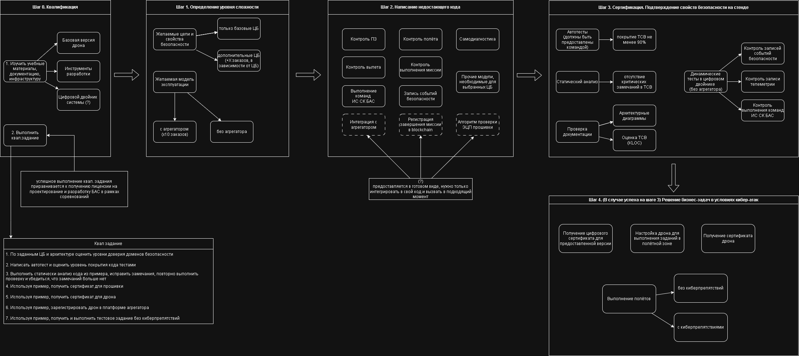

# Описание сценария соревнований

## Этап разработки

На этом этапе команды должны выбрать свою стратегию разработки дрона, цели безопасности, реализовать, протестировать и передать на проверку свой код сертифицирующей организации. 

Выполнять заказы в полётной зоне смогут только сертифицированные дроны

В графическом виде процесс подготовки к соревнованиям и квалификация выглядят следующим образом:

Ниже всё то же самое, но текстом.

### Шаг 0. Погружение и квалификация

<ul>
1. Изучить учебные материалы, документацию, инфраструктуру в репозитории 

1.1. Базовая версия дрона

1.2. Инструменты разработки и 

1.3. Цифровой двойник системы (при наличии)
</ul>

<ul>
2.  Выполнить квалификационное задание

См. подробности в [файле](qualification.md)

### Шаг1. Определение уровня сложности

1. Желаемые цели и свойства безопасности - чем больше безопасности, тем будет больше заказов (некоторые заказы недоступны для дронов, не обладающих специфическими свойствами безопасности), но и сложнее разработка

<ul>
1.1. можно выбрать только базовые цели безопасности - этого достаточно для выполнения заказов в принципе

1.2. можно выбрать дополнительные ЦБ (+X заказов, в зависимости от ЦБ)
</ul>

2. Желаемая модель эксплуатации 

<ul>
2.1. С подключением к платформе агрегатора (больше заказов, больше денег)

2.2. Без агрегатора (проще реализация)
</ul>

### Шаг 2. Написание (недостающего) кода

Недостающий код нужен для 

- самодиагностики
- контроля полётного задания
- контроля вылета
- контроля самого полёта
- контроля выполнения миссии (использования полезной нагрузки)
- выполнение команд информационной системы координации БАС
- запись событий безопасности
- прочие модули, необходимые для выбранных целей безопасности

#### Заготовки

Готовый код в виде заготовок будет предоставлен для
- интеграции с агрегатором
- регистрации завершения миссии в blockchain
- алгоритм проверки ЭЦП прошивки

Эти заготовки нужно будет интегрировать в своё решение.

### Шаг 3. "Сертификация". Подтверждение свойств безопасности на стенде

Программа и методика испытаний включает в себя

- запуск автотестов (должны быть предоставлены участниками)
    - Критерий оценки: должно быть покрыто тестами не менее 90% TCB

- статический анализ безопасности
    - Критерий оценки: должны отсутствовать критические замечания в TCB

- динамический анализ безопасности в цифровом двойнике. Будут запускаться сквозные тесты
    - Критерии оценки: 
        - наличие записей событий безопасности
        - контроль записи телеметрии
        - контроль выполнения команд информационной системы координации БАС

- проверка документации
    - Критерии оценки:
        - архитектурные диаграммы
        - оценка TCB (KLOC, цикломатическая сложность)

### Шаг 4. (В случае успеха на шаге 3) Решение бизнес-задач в условиях кибер-атак

1. Получение цифрового сертификата для предоставленной версии
2. Получение сертификата дрона
3. Настройка дрона для выполнения заданий в полётной зоне
4. Выполнение полётов 
        1) без киберпрепятствий и 
        2) с ними